**View our hackster article [here](https://www.hackster.io/dect/b-hive-a14efa "Hackster Article").**

# B-Hive
B-hive is an autonomous electronic monitoring device enabling beekeepers to oversee their hives' well-being.

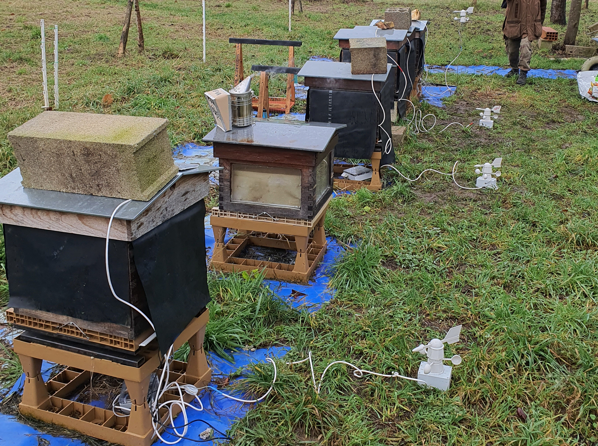

__Bees have been facing the threat of extinction for more than fifteen years. Indeed, from 30 to 40 % of bee colonies died within the last decade in Europe. This is an alarming situation for the environment since bees are the most important pollinators and therefore, an integral part of our ecosystem. Moreover, an economic issue arises. Indeed, for example in France, honey production is the additional income for more than 54,000 beekeepers and the main one for about 2,000 others.__

__Our goal is to enable beekeepers, professional or amateur, to monitor their hive remotely. Our solution is designed to save them unnecessary trips to their production site, and therefore save time. Our device is a connected sensor kit that collects data every 10 minutes and sends them to the beekeeper. This informs him on the state of his bee colonies and the quality of their environment. Our product is easy to use and affordable (about 150 €) compared to other commercialized systems.__


## Data studied
To monitor the hive's integrity we chose to study :

* Indoor temperature (+/- 0.5 °C)
* Outdoor  temperature (+/- 0.5 °C)
* Outdoor Humidity (+/- 2%)
* Weight (+/- 0.2 kg)

We also spent a large amount of time working on an Artificial Intelligence (AI) which would have been able to indicate whether or not there was a queen bee and if there were any bees at all.  Unfortunately, we were not able to implement our neural network (NN) since exporting it proved to be more intricate than expected.

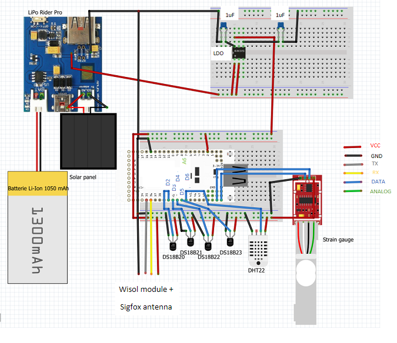


## Software 
_The Mbed source file is available to download._

For our system to work, we developed the software on Mbed. With the code we can :

* __Initialize all the sensors.__
For each sensors, we assigned a pin.

```cpp 
#define   DHT1_DATA_PIN  D6
DS1820      ds1820_1(D2);  
DS1820      ds1820_2(D3);
DS1820      ds1820_3(D4);
DS1820      ds1820_4(D5);
HX711 loadcell(D12, D11);
```

* __Get value measurements for each sensors every ten minutes.__
> Indoor temperature : We chose to use the DS18B20 temperature sensor. Indeed, this model already proved its efficiency in previous similar projects.

```cpp
//for each DS18B20
if (!ds1820_1.begin()){
        pc.printf("No DS1820 sensor found!\r\n");
        for(int i=0; i<10; i++)
        {
            ThisThread::sleep_for(250);
            if(ds1820_1.begin())
            {
                pc.printf("DS1820 sensor found on %d try\r\n", i+2);
                break;
            }
        }
    }
    else{
        pc.printf("DS1820 sensor found!\r\n");
    }
//further in the code 
 ds1820_1.startConversion();   // start temperature conversion from analog to digital
 ds1820_2.startConversion();   // start temperature conversion from analog to digital
 ds1820_3.startConversion();   // start temperature conversion from analog to digital
 ds1820_4.startConversion();   // start temperature conversion from analog to digital

 ThisThread::sleep_for(1000);// let DS1820 complete the temperature conversion
 
 result = ds1820_1.read(temp1); // read temperature from DS1820 and perform cyclic redundancy check (CRC)
 result = ds1820_2.read(temp2);
 result = ds1820_3.read(temp3);
 result = ds1820_4.read(temp4);
```

> Outdoor temperature and humidity  : We chose the DHT22 temperature and humidity sensor.

```cpp
 c_int   = sensor1.ReadTemperature(CELCIUS);
        h_int   = sensor1.ReadHumidity();
```

> Weight : We choose to use a strain gauge to collect weight values.

```cpp
int balance = ((loadcell.getValue() - 8469461)/21.5);
```

* __Send data that we have collected to Sigfox Backend.__

```cpp
Serial device(D1, D0); // tx, rx
//further in the code
device.printf("AT$SF=%02X%02X%02X%02X%02X%02X%02X%02X%04X\r\n",(char) c_ext,(char) h_ext, (char) c_int, (char) h_int,(char) temp1,(char) temp2,(char) temp3,(char) temp4, balance);
```

* __Put the micro-controller in sleep when we aren't sending data.__

```cpp
ThisThread::sleep_for(600000);
```


## AI Training
To create our Artificial Intelligence, we decided to train a neural network to analyze sound frequency in a hive. To that end, we used Edge Impulse which is a development platform. It allows you to conceive a device with embedded machine learning effortlessly.

After creating an Edge Impulse account and a project, we had the choice between two methods to train our neural network.

The first one required the use of and IoT discovery kit which we connected to Edge Impulse following [this tutorial](https://docs.edgeimpulse.com/docs/unboxing-the-st-b-l475e-iot01a "Edge Impulse Tutorial"). Then, to develop an IA able to recognize different sound frequencies, we followed the steps as explained [here](https://docs.edgeimpulse.com/docs/audio-classification).

The second methods did not required the B-L475E-IOT01A2 board. However, it was extremely time consuming. Indeed, after searching and downloading data sets ([to bee or not to bee](https://www.kaggle.com/chrisfilo/to-bee-or-no-to-bee) and [The Hiveeyes Community](https://community.hiveeyes.org/t/sound-samples-and-basic-analysis-hive-with-queen-vs-queenless/399)), each sound sample had to be hand cut and uploaded in our design. For the majority of our project, we chose this method since we were unable to collect samplings directly from a hive.

To begin, we created an impulse design and set the parameters required to train our AI. Because we are dealing with bees, we needed to take a bigger window size than the one demonstrated in the tutorial. We chose to use an MFCC bloc to train our neural network, but it was not our only option. The MFE and Spectogram blocks could have also served to train the AI. Depending on the range of frequency studied, either bloc could have worked better than the others.

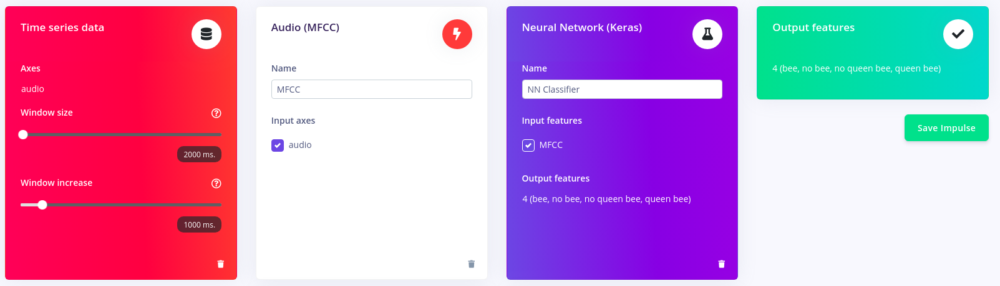

Next, we determined the number of training cycle, the learning rate and the minimum confidence rating to set as these parameters influence the accuracy of the model considerably. At the end, a confusion matrix showed the accuracy of our NN. When we were unsatisfied with the results, we uploaded additional data and retrain our model.

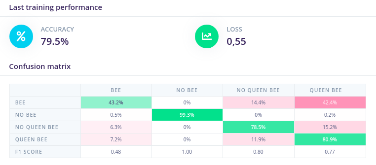

As you can see, our NN struggled to recognize when there were bees. We were not able to retrain it due to a lack of data and time.

The last step would have been to [export our AI on our STM board](https://github.com/edgeimpulse/example-standalone-inferencing-mbed).


## PCB Making
_The Kicad project file with all sources are available to download._

The first step of PCB making is to do an electrical schematic with every component.

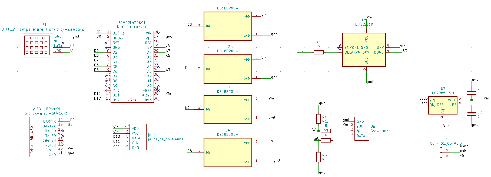

Afterwards, we followed a [tutorial](https://www.youtube.com/watch?v=C9EWrKw9Qz8&list=PLuQznwVAhY2VoayfSraJjI-Yr2OSGmFKt) to conceive our board and associated our temperature sensors to grove connectors prints for a sturdier device.

While designing the printed circuit board, we noticed some pins (D7, D8, and A7) would not allow us to collect our desired set of data. This is due to how the Nucleo STM32 is made, so before printing the board make sure  to test every pin.

Throughout our project, we produced 2 PCBs. As mentioned earlier, at first we wanted to be able to study the hive's sound frequencies. As a result,  we designed and printed a circuit board that would allow us to collect sound samples with a microphone.

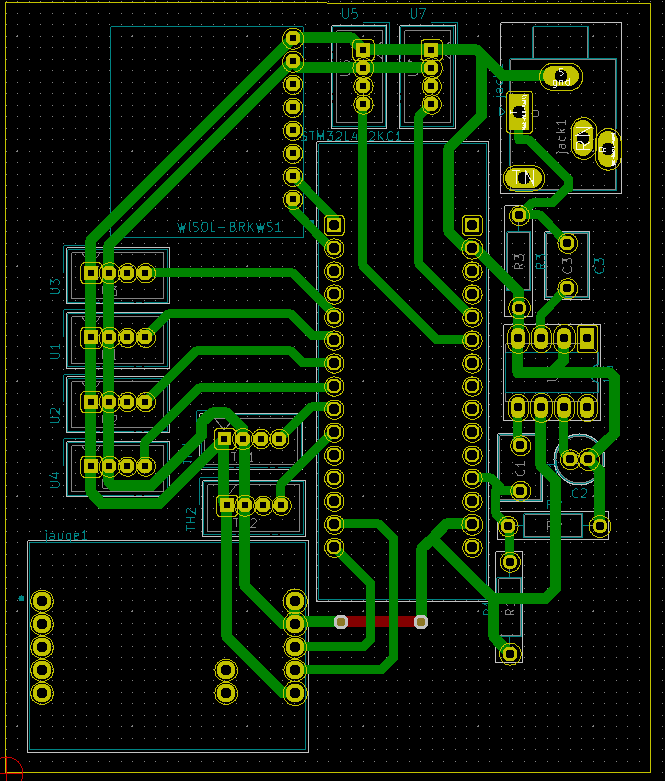
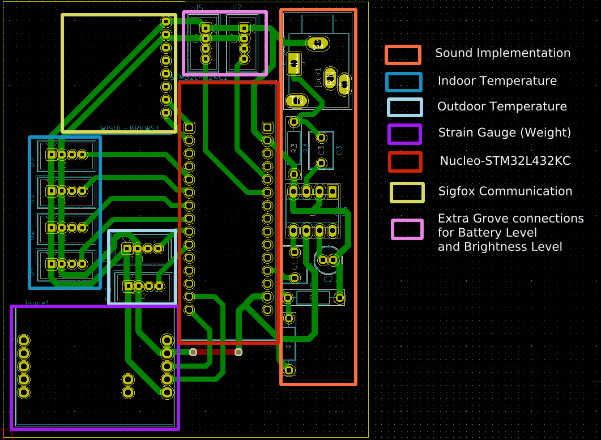

Since then, we had to design a second one to reduce our energy consumption. Considering the fact that, at that point, we were resigned not to implement the AI, we decided to downsize our system as much as possible.

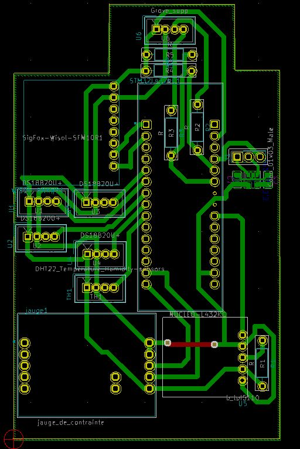
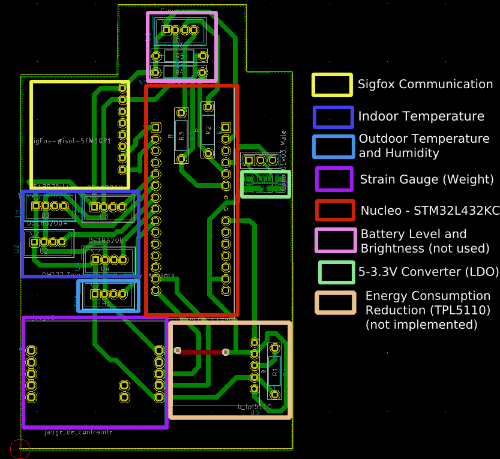

Once the design was completed, we generated the Gerber files necessary to print our circuit board. For this project, we had access to a desktop PCB milling machine for all of our printings but you can send your files to a manufacturer.


## Sigfox and Ubidots
To gather our data from a remote location, we used the Sigfox Network.

To set this up, we had to activate our Wisol device [here](https://buy.sigfox.com/activate). Then, we created and signed in on a [Ubidots account](https://industrial.ubidots.com/accounts/signin/) and added a new device.


The next step is to we configure a Callback following this [tutorial](https://help.ubidots.com/en/articles/924209-setup-your-sigfox-callback-to-talk-with-ubidots-cloud).

Last, we [created a user interface on Ubidots](https://help.ubidots.com/en/articles/2400308-create-dashboards-and-widgets) with a Dashboard to facilitate data examination.

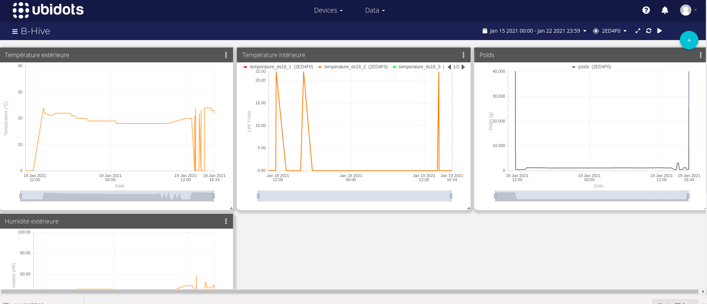

## System Energy Source 
To make our system autonomous, we chose to use a battery. The latter can be charged with solar energy thanks to the Lipo Rider Pro board which converts the energy received from the solar panel into a storable one.

Then, to feed our system, we soldered wires going from the Lipo Rider Pro to our PCB. We added an ON/OFF switch to make our system easier to use.

To reduce energy consumption, we decided to use a 5 - 3.3 Volt converter (LDO) instead of using the one embedded in the controller. Indeed, by doing this step, we were enable to take out the solder bridges SB9 and SB14 on the bottom layer of our micro-controller. We also removed the LEDs as circle below.

Unsoldering these elements must be done last since reprogramming the board would be impossible afterwards.
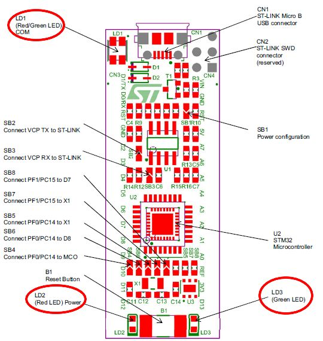
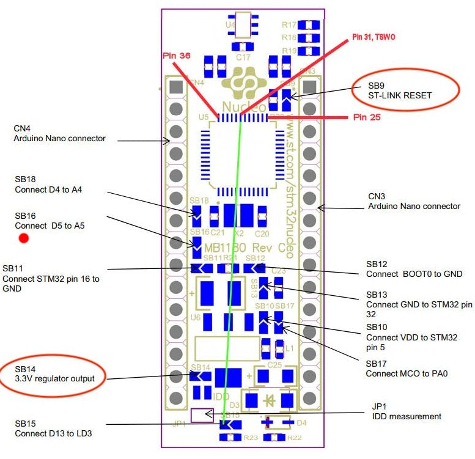

## System Assembling
First and foremost, we recommend you to use a double layered H chassis to fix the strain gauge and stabilize the hive.  Some manufacturers can construct it for you. Otherwise, you can do it yourself as pictured in the drawing below.

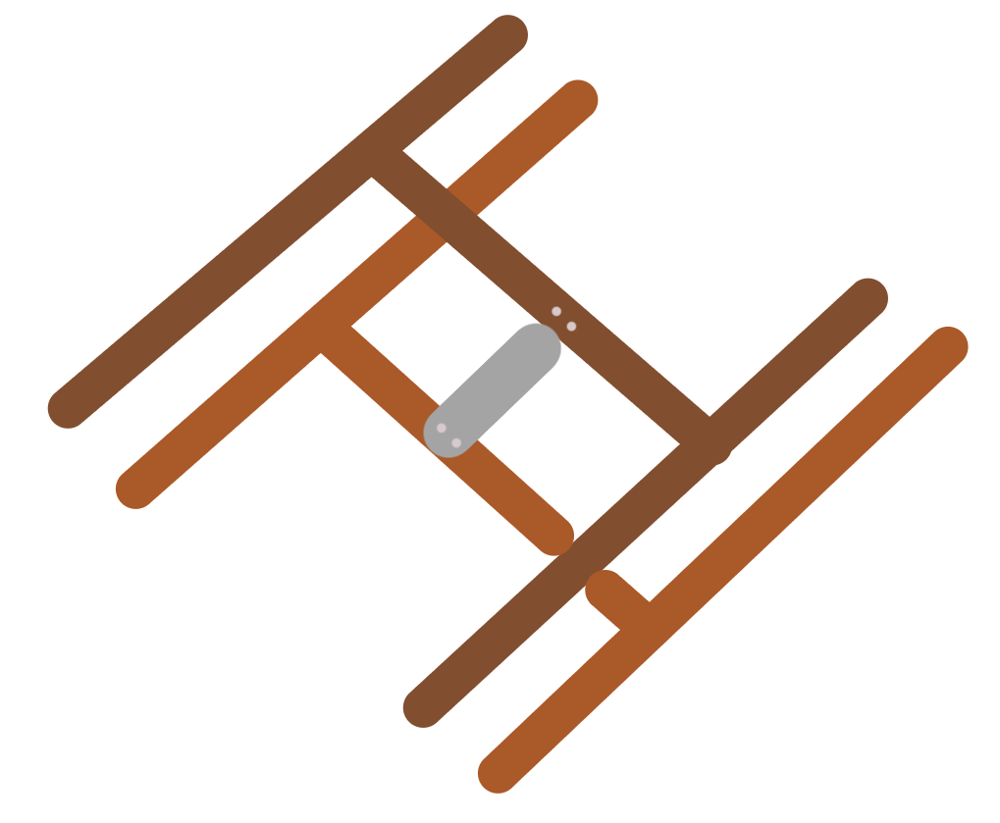

The strain gauge (gray) is screwed to the underside of the top H chassis (dark brown) and to the upper side of the bottom one (light brown). We recommend using sturdy and water-resistant material such as aluminum.

Once the system was tested and in working order,  we chose a size-adapted hermetic box. Afterwards, we placed each element meticulously in order to optimize space. We had to drill holes in the sides of the box so that our sensors could read inside the hive. Once each component was in its designated place, we screwed the lid on and hot glued around the sensors to make it waterproof.

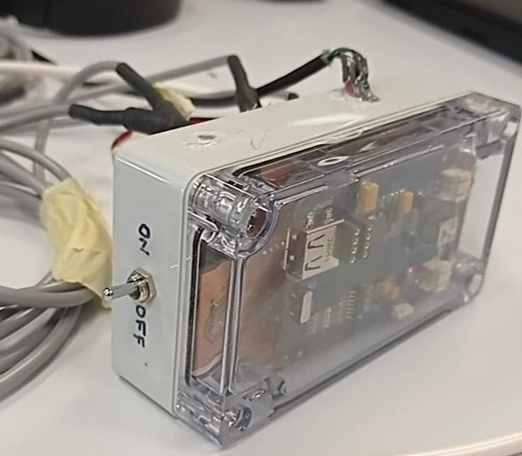


